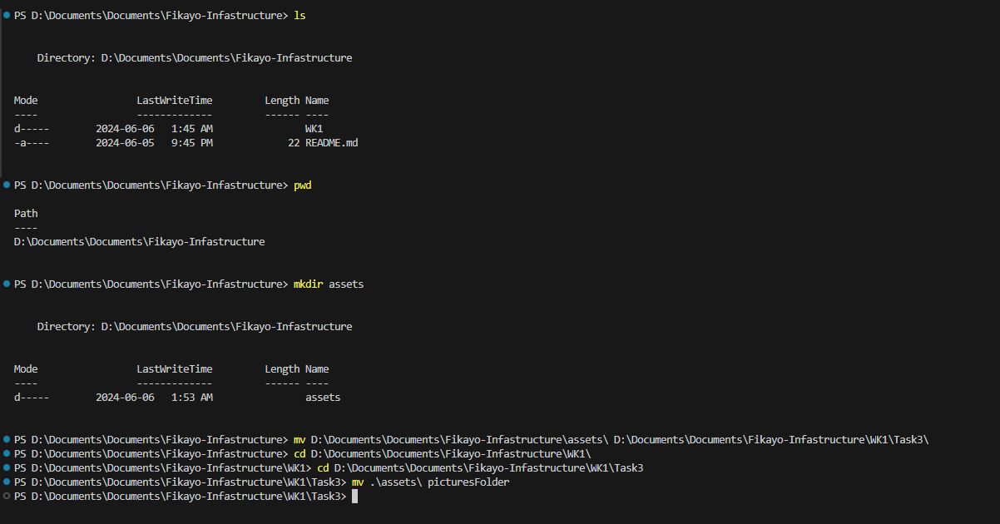
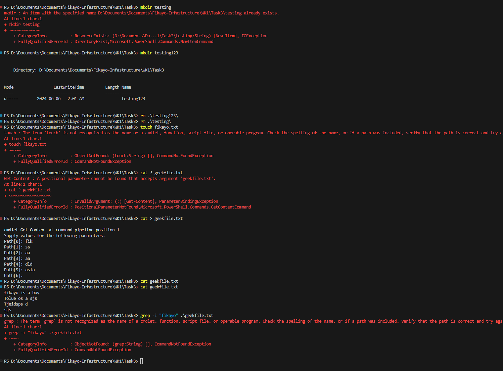

### Learning Linux

This is me familiarizing myself with linux again, I have some experience but more of beginniner leve experience with this. The documentation I used for this learnig is the Geeks for Geeks documetationfound here: [Linux Tutorial](https://www.geeksforgeeks.org/linux-tutorial/).

Firstly I learnt about the file system, learning how to create files, move files and copy files
- ls - see contents in my current directory 
- pwd - helps me know what directory i am currently in 
- mkdir - makes a directory (made an error by creating the assets folder in the root directory so i had to move it to the actual directory i wanted using the next command)
- mv - This was used to move the assets folder. This is also used to rename files 
- cd - This is used to move between directories

- rm - This is used to remove files in linux
- Touch - This is used to create files, this is different from Mkdir as that is used to make directories(folders) N:B i was using powershell so i do not have access to this command. Iused cat command instead
- grep - this is used to search for patterns in a folder, file etc it has different options when searching such as ignoring case sensitivity e.t.c not also available in powershell 

Fikayo Oluwakeye
