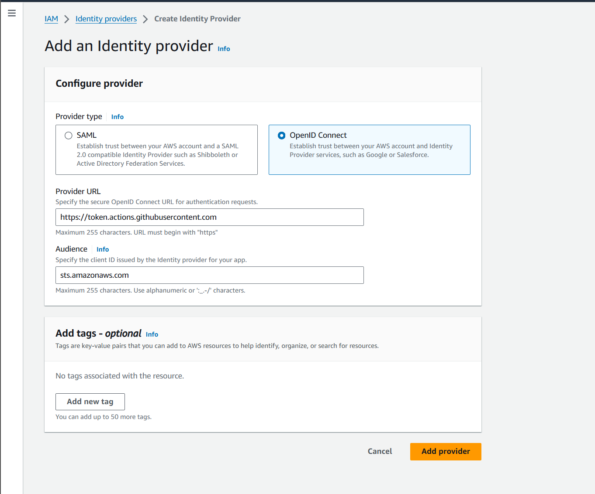
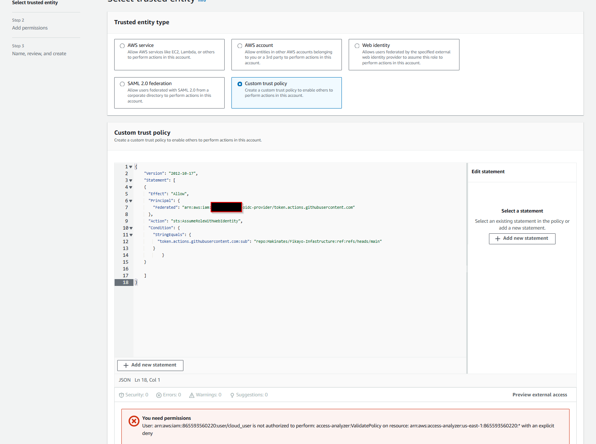
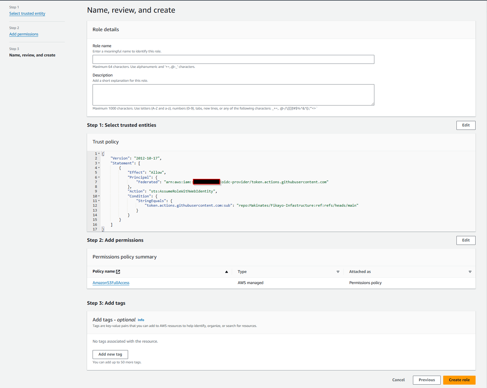
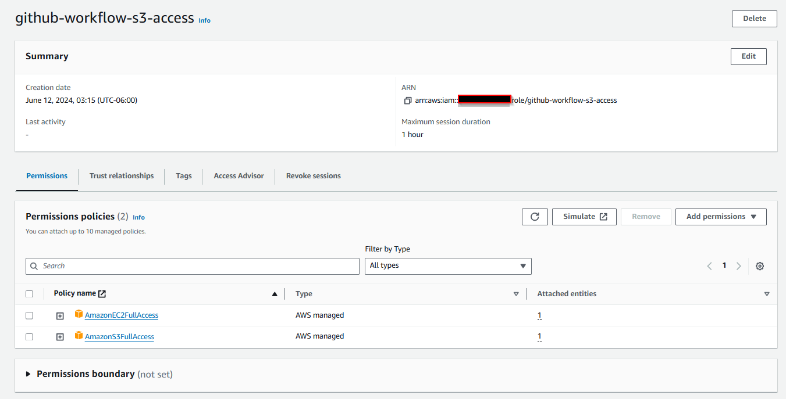
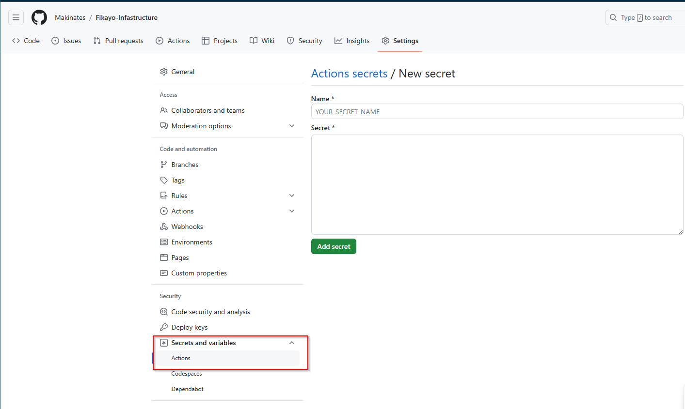
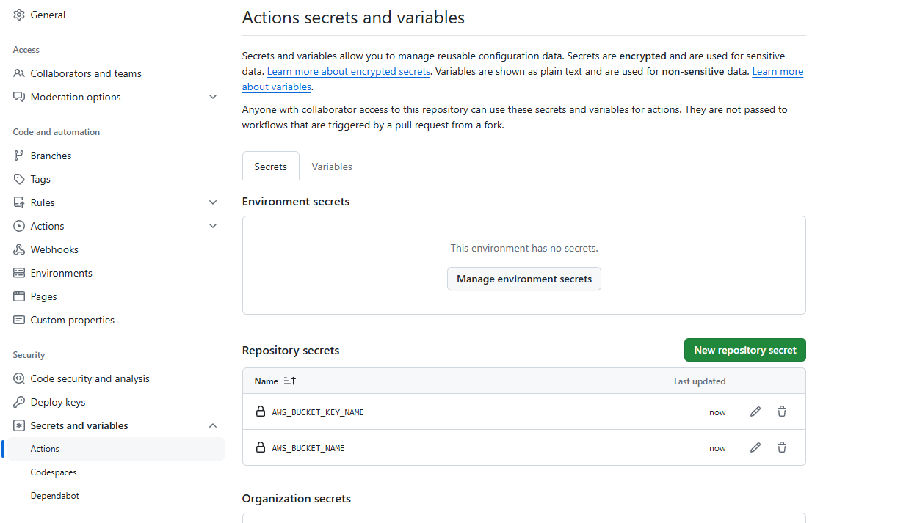
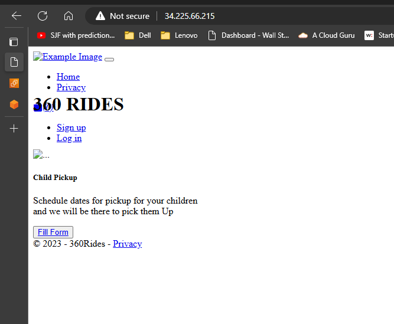

### SETTING UP CI/CD PIPELINE USING GITHUB ACTIONS

There are various methods to set up a ci/cd pipeline using github actions.

- By including the secret keys of AWS account in the github secrets.
- Assuming a role in AWS (more secure)

I went by step 2 in order to learn more about roles in AWS and below are the steps to authenticate to my AWS account.

### Authenticating to AWS

- First step was to create an **identity provider** in AWS. What is an identity provider? [Identity Providers](https://www.okta.com/identity-101/why-your-company-needs-an-identity-provider/). AWS has two provider type: SAML and OpenID. (Done in AWS not thrrough terraform)
- I made changes to the github workflow to only run when changes are made to WK1 folders to server as my control.

```
https://token.actions.githubusercontent.com

sts.amazonaws.com
```



- Created a bucket to store my terraform state files(github-action-flow).

- Then I created a custom trust policy which is the role the user will assume when they sign in using their github credentials.

```
{
    "Version": "2012-10-17",
    "Statement": [
        {
            "Sid": "AllowAssumeRoleWithWebIdentity",
            "Effect": "Allow",
            "Principal": {
                "Federated": "arn:aws:iam::{your account id}:oidc-provider/token.actions.githubusercontent.com"
            },
            "Action": "sts:AssumeRoleWithWebIdentity",
            "Condition": {
                "StringEquals": {
                    "token.actions.githubusercontent.com:sub": "repo:Makinates/Fikayo-Infastructure:ref:refs/heads/main"
                }
            }
        }
    ]
}

```





### Adding Secrets to Github





### How to create github workflow

In order to create the workflow, we have to create a special directory for the yml file as this is where github will pull from. The folder structure looks like this **_.github/workflows/_.yml**

After the Yml file was created I moved the folder to the root directory and then it failed. Due to several reasons which I fixed :

- Changed my ec2 ami to an ubuntu AMI which led to changes in my commands from yum to apt
- I also installed mariadb to serve as my local database so i followed this material to get it installed on my ec2 instance
Once the database was up I created a db in it using this commands. This is after i connected to the db step is in the website link I attached
```
CREATE DATABASE mydb
USE mydb - switches to the db server
```
  [MariaDb](https://phoenixnap.com/kb/how-to-install-mariadb-ubuntu)

```

        "sudo apt update -y",
  #     "sudo apt install -y git",
        "sudo apt install nginx"
  #     "sudo apt install dotnet-sdk-6.0",  # Install .NET SDK
  #     "git clone https://github.com/fikay/360Rides.git",
  #     "cd 360Rides",
  #     "dotnet restore",  # Restore dependencies
  #     "dotnet publish -c Release -o published",  # Publish the application
  #     "sudo cp -r published /var/www/360Rides",  # Copy published files to web server directory
        cd /var/www/360Rides
        dotnet 360
  #     "sudo systemctl restart nginx"  # Restart web server (assuming you're using Nginx)

```

The server kept running the default nginx home page so i ahd to reconfigure the default file found at **_/etc/nginx/sites-available_**

E=xample of config used :

```
server {
    listen 80;
    listen [::]:80;

    server_name example.com;  # Replace with your domain or server IP

    location / {
        proxy_pass         http://localhost:5000;  # Replace with your .NET app's URL
        proxy_http_version 1.1;
        proxy_set_header   Upgrade $http_upgrade;
        proxy_set_header   Connection keep-alive;
        proxy_set_header   Host $host;
        proxy_cache_bypass $http_upgrade;
        proxy_set_header   X-Forwarded-For $proxy_add_x_forwarded_for;
        proxy_set_header   X-Forwarded-Proto $scheme;
    }

    error_log /var/log/nginx/dotnetapp_error.log;
    access_log /var/log/nginx/dotnetapp_access.log;
}

```

Once that was


```
dotnet ef migrations add newMigration --project 360.DataAccess --startup-project 360Rides
dotnet ef database update  --project 360.DataAccess --startup-project 360Rides
```


