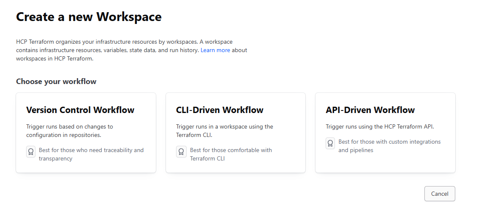
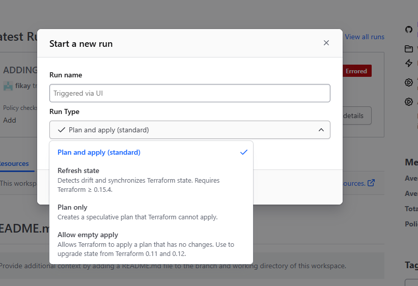
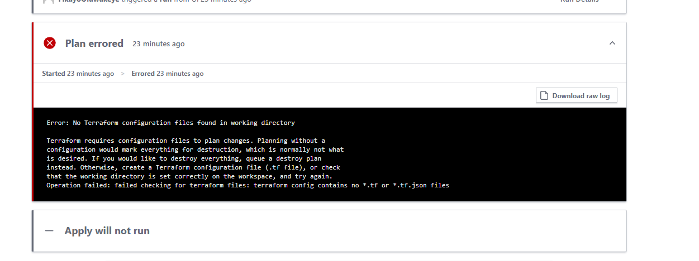
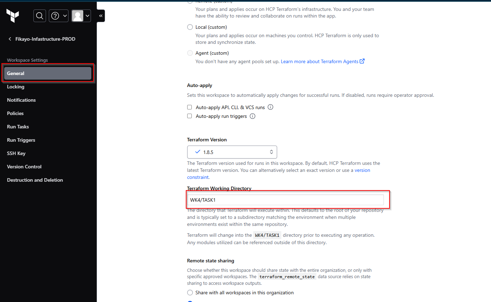
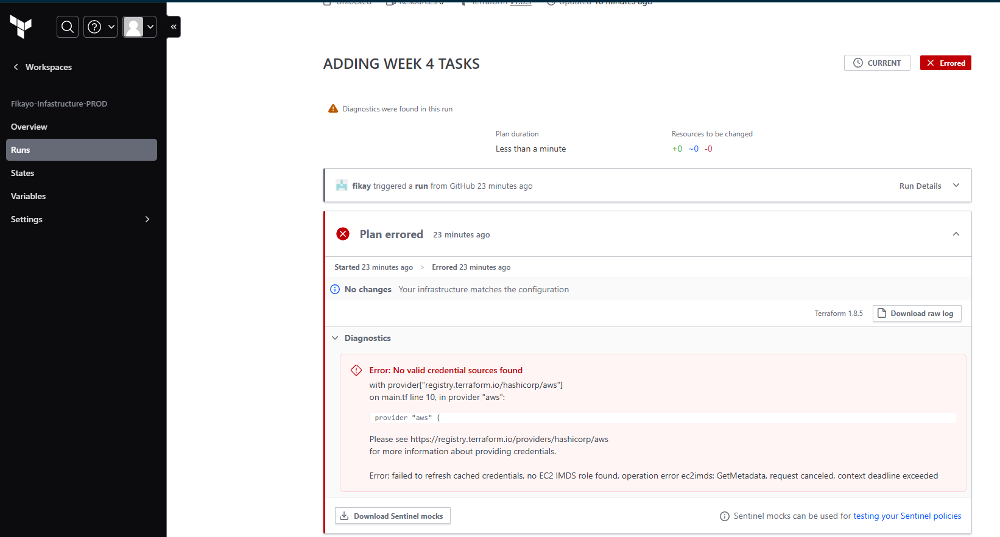
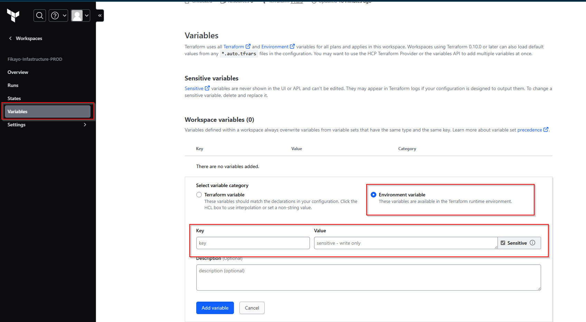

### IMPLEMENTING TERRAFORM STATE MANAGEMENT USING TERRAFORM CLOUD

In order to save the terraform state files and have a ci/cd flow, I implemented the use of terraform cloud to give me a workflow. Below indicates the steps followed to use it:

- First step is to create a terraform cloud account.
- Then once logged in, create a Project in this case I called my project ***Makinates-Fikayo-infastructure-PROD***.
- Once that has been created, We will have to create a workspace and this will prompt for certain things such as:
    
 For this project we will be using VCS(Version control workflow).
- This will prompt the connecting to a github account and repository which for this case is the Makinates-fikayo-infastructure.
- Once this has been fully created, a push to the githuub repository, triggers a run in terraform cloud but this can also be triggered manually in the terrfaorm cloud CLI e.g
   
- For my first push to github it resulted in a failed run why? This i sbecause my root folder has no ***main.tf*** file which will result in this:
    
To fix this I had to specify my actual folder where the cloud should target
    
- Now that the error was fixed I triggered a new ruun but that resulted in a fail also why? Because it requires the AWS credentials:
    
In order to fix this I had to add variables in my terraform cloud variables settings
    