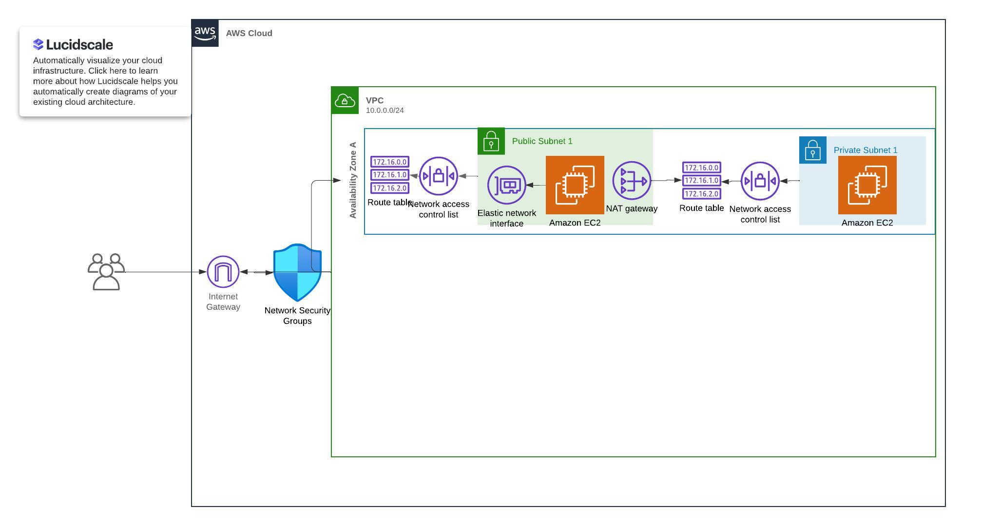

### Network Diagram




### Security Measures

The security Measures I implemented basically followws the least priviledge methodology. 

- VPC : The security measures for this Includes
    - At the subnet level, an NACL was implemented which restricted traffic for the:
        - Private subnet - to just SSH for only IP addresses in the VPC 
        - Public subnet - to both ICMP, SSH (just certain IP addresses) AND HTTP any IP address
        - Link to code snippet - [Security Groups and NACL](../TASK1/modules/vpc/securityGroups.tf)
    - At the route table 
        - Public subnet - has a route to the internet(IGW)
        - Private subnet - has a route to a nat gateway connected to the IGW
        - Link to CODE - [VPC CONFIG ](../TASK1/modules/vpc/Vpc.tf)
    - At the VPC level - A security group which allows access to custom network traffic including HTTP,SSH AND ICMP.
        - public SG - Allows access to the internet and 3 other network traffic stated above.
        - Private SG - Allows access to just SSH for only IP         addresses in the VPC 
        -  Link to CODE - [VPC CONFIG ](../TASK1/modules/vpc/Vpc.tf)
    - Only users with IAM policy which allows modification to the VPC have access to change anything in the VPC
    - Link to roles and Policies - [Roles and Policies](../TASK1/modules/vpc/roles.tf)
- EC2 -  The Security measure for the EC2 was to attach an ENI  which utilizes the VPC  security group.
    - public EC2 - utilizes public SG 
    - Private Ec2 - utilizes Private SG
    - Only uses which EC2 policy attached to their IAM roles can also SSH into both the public and with a specific IP address into the private EC2 instance 


### Secrets Management 
For this Task I used terraform to create the secrets Manager
Code to secretsConfig - [Secrets](../TASK1/modules/vpc/SecretManager.tf)

I also Granted acces to the Ec2 instances which will run the application to be able to access the secrets manager in order to retrive the secrets.
 - - Link to roles and Policies - [Roles and Policies](../TASK1/modules/vpc/roles.tf)

 ***Code snippet in Application which will extract the keys from the manager***

 ```c#
 using Amazon.SecretsManager;
using Amazon.SecretsManager.Model;
using Microsoft.Extensions.Configuration;
using System;
using System.Threading.Tasks;

public class SecretsManagerService
{
    private readonly IAmazonSecretsManager _secretsManager;

    public SecretsManagerService(IAmazonSecretsManager secretsManager)
    {
        _secretsManager = secretsManager;
    }

    public async Task<string> GetSecretAsync(string secretName)
    {
        var request = new GetSecretValueRequest
        {
            SecretId = secretName
        };

        var response = await _secretsManager.GetSecretValueAsync(request);

        return response.SecretString;
    }
}
 ```


 N:B I do not have an application that runs this but I know this will work as I use this process on Azure key vault just have to switch the nuget packgae from azure to AWS.