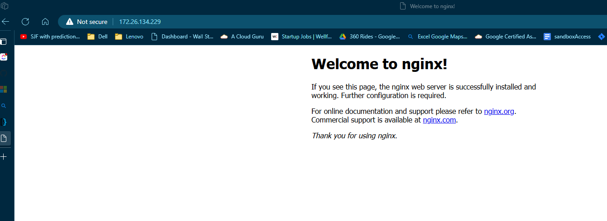

### USER GROUP MANAGEMENT 

To create new Users, we use the Useradd command 

Link to options we can use with the command:   [UserAdd](https://www.geeksforgeeks.org/useradd-command-in-linux-with-examples/)

I will be usign the commands to build out a Web server environment 

#### WEB ENVIRONMENT

 - Creating the User with a user Id
    
    ```
    sudo useradd -u 8296 fikayo-faks

    ##To view all users 
    getent passwd
    ```
    

- Create a new group and add User to group 
    ```
    sudo groupadd webserver

    sudo tail /etc/group 

    usermod -g webserver fikayo-faks
    ```
    

-  Create new partition for web data 
        
    

- Create filesytsem to new partition
    ```
        # Start parted on the disk
        sudo parted /dev/sda

        # Inside parted:
        # Create a new GPT partition table
        (parted) mklabel gpt

        # Create a new partition
        (parted) mkpart
        Partition name?  []? primary
        File system type?  [ext2]? ext4
        Start? 0%
        End? 100%

        # Verify the partition
        (parted) print

        # Quit parted
        (parted) quit

        # Format the partition
        sudo mkfs.ext4 /dev/sda1  

        # Create a mount point and mount the partition
        sudo mkdir /mnt/webdata
        sudo mount /dev/sda1 /mnt/webdata

        # Add the mount to fstab for persistence
        echo '/dev/sda1 /mnt/webdata ext4 defaults 0 2' | sudo tee -a /etc/fstab

    ```

- Install Web Server 
    ```
    sudo apt update
    sudo apt install nginx

    #Start and enable the web server
    sudo systemctl start nginx
    sudo systemctl enable nginx
    ```
    Ran into an error whereby I could not start the server 
    ```
    sudo systemctl start nginx
    sudo systemctl enable nginx
    System has not been booted with systemd as init system (PID 1). Can't operate.
    Failed to connect to bus: Host is down
    Synchronizing state of nginx.service with SysV service script with /lib/systemd/systemd-sysv-install.
    ```
    In order to bypass this, I used these set of commands
    ```
    sudo service nginx start

    sudo service nginx status

    ``` 

    and to ensure it starts on boot next startup I used 
    ```
    sudo systemctl enable nginx

    ```
-  Task Scheduling 
    ```
    crontab -e
    # Select nano as my editor
    # This creates a gzip-compressed tar backup of /var/www/html into /mnt/webdata daily at 2 AM.
    0 2 * * * tar -czf /mnt/webdata/backup_$(date +\%Y\%m\%d).tar.gz /var/www/html

    ```
    


- Monitoring using `PS` and `Top`

    

- Security - I restricted the var/www/html folder to the webgroup which I created 
    ```
    sudo chown -R fikayo-faks:webserver /var/www/html
    ```

- Testing - to get the ip address on nginx I used the followign command
    ```
    hostname -I
    ```
    
    