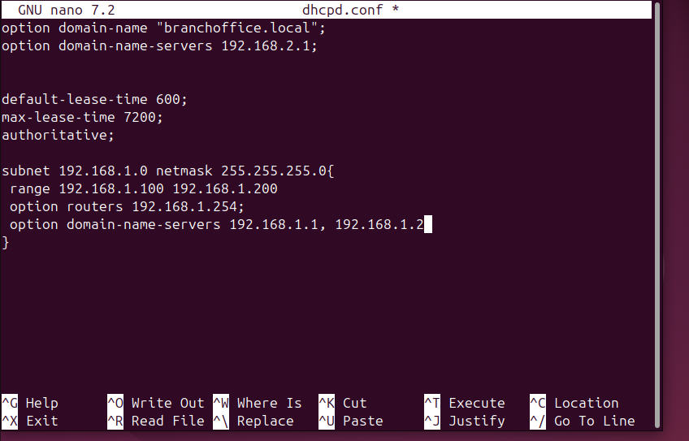

### NETWORK ADMINISTRATION

In order to start this task, I had to install virtual box which allows me to create several VM'S in order to complete the tasks.
myguest.virtualbox.org
## Creating my Ubuntu and windows VM
I downloaded the ISO file from the ubuntu website and windows website(this requires some extra steps. Switching my network source to safari MacOs using developer tools)and followed the documentation on the website and that  assisted in getting everything set up. [Documentation](https://www.virtualbox.org/manual/ch01.html#hostossupport)


## Installing Server on the Ubuntu machine

Guide Used : [DHCP](https://www.linuxfordevices.com/tutorials/ubuntu/dhcp-server-on-ubuntu)

Domain-name = branchoffice.local
#steps
- Install the DHCP server and Bind9
    ```
    sudo apt install isc-dhcp-server
    sudo apt install bind9
    ```
- Created a copy of the conf file just in case
    
- Create config file and bind interface
    
    I added a static address for my windows VM so it doesnt change. Not in picture as I do not want my MAC address to be public.
    ```
    #Bind interfacesudo 
    sudo nano etc/default/isc-dhcp-server 
    ```
- Started up the server

    

## Configuring the DNS 

Learning link: [BIND9](https://www.linuxtechi.com/install-configure-bind-9-dns-server-ubuntu-debian/)

# Setting up BIND9
  ***File - named.conf.options file***

  **use**

  Allow Query: Only friends (computers in your private network) can ask questions.

  Allow Recursive Query: If the library doesn't know, it will go find out from other libraries.

  DNS Port (53): All questions must come through the special door with number 53.

  Forwarders: If the library doesn't know, it asks the bigger libraries for help.

  Config
  ```
  acl internal-network {
    10.0.2.0/24;
};
options {
        directory "/var/cache/bind";
        allow-query { localhost; internal-network; };
        allow-transfer { localhost; };
        forwarders { 8.8.8.8; };
        recursion yes;
        dnssec-validation auto;
        listen-on-v6 { any; };
};
  ```
  ***File - named.conf.local file***

  **use**

  In this file we will define the zone files for our domain
Config
```
zone "branchoffice.local" IN {
        type master;
        file "/etc/bind/forward.branchoffice.local";
        allow-update { none; };
};
zone "0.168.192.in-addr.arpa" IN {
        type master;
        file "/etc/bind/reverse.branchoffice.local";
        allow-update { none; };
};
```
Now we have to create both files so they can be used 

**forward.branchoffice.local**
```
$TTL 604800
@ IN SOA primary.branchoffice.local. root.primary.branchoffice.local. (
                                   2022072651 ; Serial
                                   3600 ; Refresh
                                   1800 ; Retry
                                   604800 ; Expire
                                   604600 ) ; Negative Cache TTL
;Name Server Information
@       IN  NS    primary.branchoffice.local.

;IP address of Your Domain Name Server(DNS)
primary IN  A     10.0.2.0

;Mail Server MX (Mail exchanger) Record
linuxtechi.local. IN MX 10   mail.linuxtechi.local.

;A Record for Host names
www     IN  A    10.0.2.0.10
mail    IN  A    10.0.2.0.20

;CNAME Record
ftp     IN CNAME www.linuxtechi.local.
```

**reverse.branchoffice.local**
```
$TTL 86400
@ IN SOA branchoffice.local. root.branchoffice.local. (
                           2022072752 ;Serial
                           3600 ;Refresh
                           1800 ;Retry
                           604800 ;Expire
                           86400 ;Minimum TTL
)
;Your Name Server Info
@ IN NS primary.branchoffice.local.
primary   IN  A    192.168.0.40
;Reverse Lookup for Your DNS Server
40        IN PTR   primary.branchoffice.local.
;PTR Record IP address to HostName
50        IN PTR   www.branchoffice.local.
60        IN PTR   mail.branchoffice.local.
```
Then Update bind in ***/etc/default/bind*** file
```
OPTIONS="-u bind -4"
```


### SETTING UP THE VPN ON THE MAIN SYSTEM 
Link to Guide - [VPN INSTALLATION](https://ubuntu.com/server/docs/how-to-install-and-use-openvpn)
- Install VPN 
    ```
    sudo apt update
    sudo apt install openvpn easy-rsa
    ```
- Set up the CA Directory 
    ```
    sudo make-cadir /etc/openvpn/easy-rsa

    # Run this commmands in the directory
    
    sudo ./easyrsa init-pki
    sudo ./easyrsa build-ca 

    Common Name: Easy-RSA CA
    CA was stored at :  /home/fikayo/openvpn-ca/pki/ca.crt
    ```

- Generate a key pair for the server 
    ```
    Sudo ./easyrsa gen-req Easy-RSA CA nopass

    # Common Name : Easy-RSA
    
    sudo ./easyrsa gen-dh

    ##Create a certificate for the server
    sudo ./easyrsa sign-req server Easy-RSA CA
    
    # Move all the files to one folder
    cp pki/dh.pem pki/ca.crt pki/issued/Easy-RSAcrt pki/private/Easy-RSA.key /etc/openvpn/
    ```
    
    

- Generate Client Certficate


- Configure the VPN
    ```
    ls -l /usr/share/doc/openvpn/examples/sample-config-files/
    sudo cp /usr/share/doc/openvpn/examples/sample-config-files/server.conf.gz /etc/openvpn/myserver.conf.gz
    sudo gzip -d /etc/openvpn/myserver.conf.gz
    ```

    Edit /etc/openvpn/myserver.conf to make sure the following lines are pointing to the certificates and keys you created in the section above.
    ```
    ca ca.crt
    cert myservername.crt
    key myservername.key
    dh dh2048.pem
    ```

#### Branch server

     It follows mostly the same steps as the main server except for few minor changes 

        -  Install dhcp and bind9 as above
      - Configure bind9
        ```
        options {
        directory "/var/cache/bind";
        forwarders { <main-office-dns-ip>; };
        allow-query { localhost; 10.0.2.0/24; };
        allow-recursion { localhost; 10.0.2.0/24; };
        recursion yes;
        dnssec-validation auto;
        listen-on { 10.0.2.0/24; };
        listen-on-v6 { none; };
        }   ;
        ```
        ```
        zone "branchoffice.local" {
            type slave;
            file "/var/lib/bind/db.branchoffice.local";
            masters { 10.0.2.1; };  
        };
        ```


     - Update Firewalls
        ```
        sudo iptables -A INPUT -p udp -s 192.168.2.0/24 --dport 53 -j ACCEPT
        sudo iptables -A INPUT -p tcp -s 192.168.2.0/24 --dport 53 -j ACCEPT

        ```

On configuring the branch office, I was able to dig the mainoffice using this:

 


Pinging from the branch office


### Using Nmap

```
sudo apt install nmap 
sudo nmap 10.0.2.15 
```

