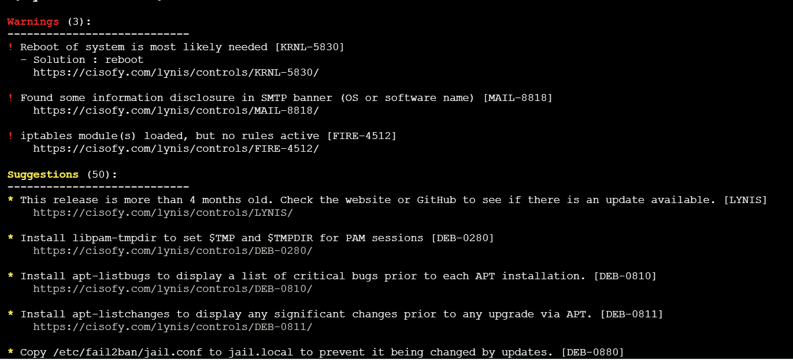
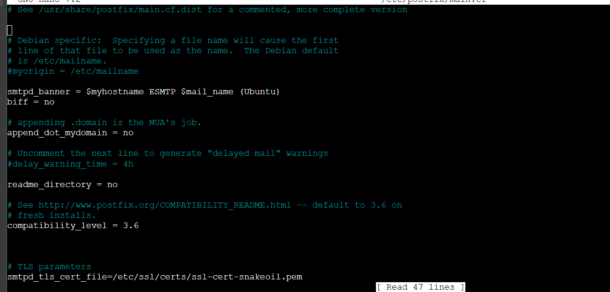
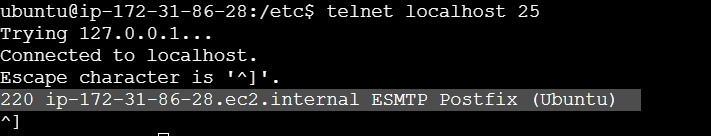
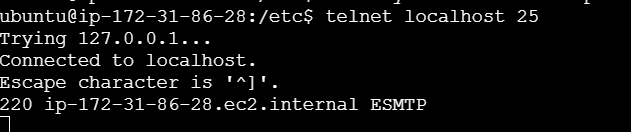
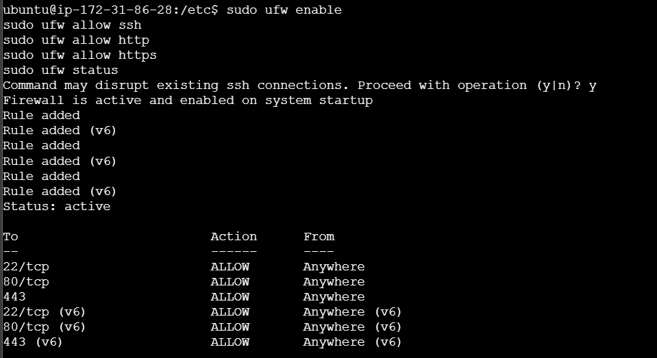
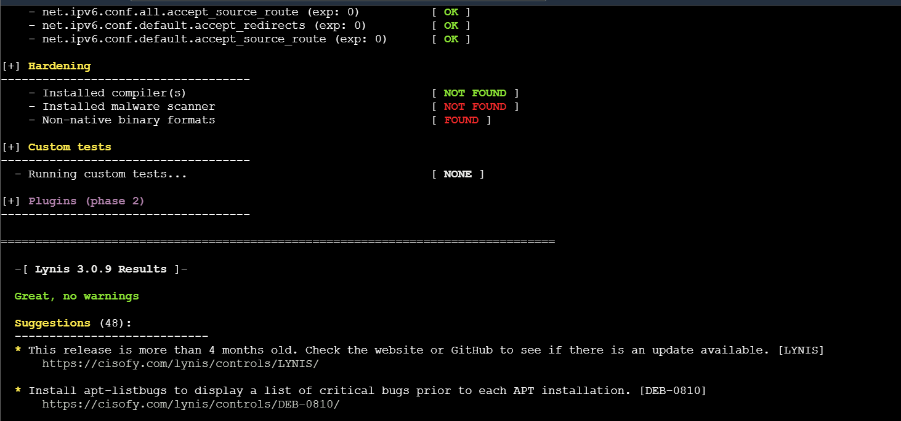

### LINUX SECURITY HARDENING

First step was to provision my test server on the aws console manually or through my terraform script. Decided to go the manual route


I connected to the machine using the amazon instance connect


I then created a bash script on the machine which would:

    - Update the system
    - Install necessary packages (e.g., web server, fail2ban)
    - Configure SSH (disable root login, use key-based auth)

## Bash script creation steps

- touch hardenscript.sh
- nano hardenScript.sh

```
#!/bin/bash

# Update the system
sudo apt update
sudo apt upgrade -y

# Install necessary packages
sudo apt install -y nginx fail2ban aide

# Configure SSH
sudo sed -i 's/#PermitRootLogin prohibit-password/PermitRootLogin no/' /etc/ssh/sshd_config
sudo sed -i 's/PasswordAuthentication yes/PasswordAuthentication no/' /etc/ssh/sshd_config
sudo systemctl restart sshd

# Configure Fail2Ban
sudo systemctl enable fail2ban
sudo systemctl start fail2ban

echo "Initial hardening completed."

```

- Make the script executable

```
   chmod +x hardenScript.sh
```

N:B this script works on most linux systems but due to the fact that I am using an amazon linux machine, the commands are slightly different as the **apt** is changed to **yum**

UPDATED SCRIPT

```
#!/bin/bash

# Update the system
sudo yum update -y

# Install necessary packages
sudo yum install -y nginx fail2ban aide

# Configure SSH
sudo sed -i 's/#PermitRootLogin yes/PermitRootLogin no/' /etc/ssh/sshd_config
sudo sed -i 's/PasswordAuthentication yes/PasswordAuthentication no/' /etc/ssh/sshd_config
sudo systemctl restart sshd

# Configure Fail2Ban (basic configuration)
sudo systemctl enable fail2ban
sudo systemctl start fail2ban

echo "Initial hardening completed."

```

- Check if the packages were installed

```
rpm -q nginx fail2ban aide
```

I noticed there were more chnages in regards to the amazon linux machine in regards to installing fail2ban and was able to move through it using this technique
[Fail2Ban installation](https://gist.github.com/johnstanfield/213ab7d58d585f3adce25cd16d053676)
[More steps](https://repost.aws/questions/QU_Mw5I44TQ_ucMNb73Lakbw/fail2ban-mia-for-amazon-linux-2023)

I switched to an Ubuntu test server -
To see if they ere installed

```
dpkg -l | grep -E "nginx|fail2ban|aide"
```


- Check ssh config

```
sudo grep -E "PermitRootLogin|PasswordAuthentication" /etc/ssh/sshd_config

```


#### SETTING UP AIDE

On installiing aide, we review the configuration file using:
sudo nano /etc/aide/aide.conf

```
 AIDE conf
# This configuration file does not contain every possible option
# For a complete reference, see man aide.conf(5)

# set environment for executable config files included by x_include
@@x_include_setenv UPAC_settingsd /etc/aide/aide.settings.d
@@x_include_setenv PATH /bin:/usr/bin

# The daily cron job depends on these paths and settings
database_in=file:/var/lib/aide/aide.db
database_out=file:/var/lib/aide/aide.db.new
database_new=file:/var/lib/aide/aide.db.new
gzip_dbout=yes

# Set to no to disable report_summarize_changes option.
#report_summarize_changes=true

# Set to no to disable grouping of files in report.
#report_grouped=true

# have AIDE version and time of database generation in database
#database_add_metadata=true

# Set verbosity of aide run and reports
#log_level=warning
#report_level=changed_attributes
```

- Setting up the initial database

```
sudo aideinit
sudo mv /var/lib/aide/aide.db.new /var/lib/aide/aide.db
```

This creates a database in the /var/lib/aide folder


- Set Up CRON job to do daily checks and send email

```
#!/bin/bash
AIDE_OUTPUT=$(sudo /usr/bin/aide --check --config=/etc/aide/aide.conf)
echo "$AIDE_OUTPUT" | mail -s "AIDE Integrity Check Report" fikayofakeye@yahoo.com


sudo chmod +x /usr/local/bin/aide-check.sh
sudo crontab -e
0 1 * * * /Home/Ubuntu/aideCronJob.sh
```

#### INSTALL LYNIS

```
sudo apt install -y lynis
sudo lynis audit system
```

**_FINDINGS_** - ! Reboot of system is most likely needed - Found some information disclosure in SMTP banner - iptables module(s) loaded, but no rules active - Install libpam-tmpdir to Set $TMP and $TMPDIR for PAM Sessions - Install apt-listbugs to Display a List of Critical Bugs Prior to Each APT

**_FIX_**

```
sudo reboot

## For smtp banner
sudo nano /etc/postfix/main.cf

smtpd_banner = $myhostname ESMTP
sudo systemctl reload postfix


### Add firewalls
sudo ufw enable
sudo ufw allow ssh
sudo ufw allow http
sudo ufw allow https
sudo ufw status

###
sudo apt install libpam-tmpdir

###
sudo apt install apt-listbugs
```
### Images for Fixes

***SMTP FIX***



***Affter Fix***




***IP TABLES***



Rerunning the audit after the fixes to 5 errors returned



***Had issues chnaging permissions of my keypair so moved it to wsl file system to use ***

```
mkdir -p ~/keys
cp /mnt/d/Documents/Documents/Fikayo-Infastructure/wk7/keyPair.pem ~/keys/
chmod 400 ~/keys/keyPair.pem

***Running Ansible Playbooks***
[webservers]
3.88.174.45 ansible_ssh_private_key_file=~/keys/keyPair.pem ansible_user=ubuntu
ansible-playbook -i inventory.ini playbook.yml

```


https://learningcurve.hashnode.dev/


```
fatal: [3.88.174.45]: FAILED! => {
    "ansible_facts": {},
    "changed": false,
    "failed_modules": {
        "ansible.legacy.setup": {
            "ansible_facts": {
                "discovered_interpreter_python": "/usr/bin/python"
            },
            "deprecations": [
                {
                    "msg": "Distribution ubuntu 24.04 on host 3.88.174.45 should use /usr/bin/python3, but is using /usr/bin/python for backward compatibility with prior Ansible releases. A future Ansible release will default to using the discovered platform python for this host. See https://docs.ansible.com/ansible/2.10/reference_appendices/interpreter_discovery.html for more information",
                    "version": "2.12"
                }
            ],
            "exception": "Traceback (most recent call last):\r\n  File \"/home/ubuntu/.ansible/tmp/ansible-tmp-1723524020.1358864-1695-116597879630320/AnsiballZ_setup.py\", line 102, in <module>\r\n    _ansiballz_main()\r\n  File \"/home/ubuntu/.ansible/tmp/ansible-tmp-1723524020.1358864-1695-116597879630320/AnsiballZ_setup.py\", line 94, in _ansiballz_main\r\n    invoke_module(zipped_mod, temp_path, ANSIBALLZ_PARAMS)\r\n  File \"/home/ubuntu/.ansible/tmp/ansible-tmp-1723524020.1358864-1695-116597879630320/AnsiballZ_setup.py\", line 37, in invoke_module\r\n    from ansible.module_utils import basic\r\n  File \"/tmp/ansible_ansible.legacy.setup_payload_4f4kgnt4/ansible_ansible.legacy.setup_payload.zip/ansible/module_utils/basic.py\", line 176, in <module>\r\nModuleNotFoundError: No module named 'ansible.module_utils.six.moves'\r\n",
            "failed": true,
            "module_stderr": "OpenSSH_8.9p1 Ubuntu-3ubuntu0.4, OpenSSL 3.0.2 15 Mar 2022\r\ndebug1: Reading configuration data /etc/ssh/ssh_config\r\ndebug1: /etc/ssh/ssh_config line 19: include /etc/ssh/ssh_config.d/*.conf matched no files\r\ndebug1: /etc/ssh/ssh_config line 21: Applying options for *\r\ndebug2: resolve_canonicalize: hostname 3.88.174.45 is address\r\ndebug3: expanded UserKnownHostsFile '~/.ssh/known_hosts' -> '/home/fikayofaks/.ssh/known_hosts'\r\ndebug3: expanded UserKnownHostsFile '~/.ssh/known_hosts2' -> '/home/fikayofaks/.ssh/known_hosts2'\r\ndebug1: auto-mux: Trying existing master\r\ndebug2: fd 3 setting O_NONBLOCK\r\ndebug2: mux_client_hello_exchange: master version 4\r\ndebug3: mux_client_forwards: request forwardings: 0 local, 0 remote\r\ndebug3: mux_client_request_session: entering\r\ndebug3: mux_client_request_alive: entering\r\ndebug3: mux_client_request_alive: done pid = 1677\r\ndebug3: mux_client_request_session: session request sent\r\ndebug1: mux_client_request_session: master session id: 2\r\ndebug3: mux_client_read_packet: read header failed: Broken pipe\r\ndebug2: Received exit status from master 1\r\nShared connection to 3.88.174.45 closed.\r\n",
            "module_stdout": "Traceback (most recent call last):\r\n  File \"/home/ubuntu/.ansible/tmp/ansible-tmp-1723524020.1358864-1695-116597879630320/AnsiballZ_setup.py\", line 102, in <module>\r\n    _ansiballz_main()\r\n  File \"/home/ubuntu/.ansible/tmp/ansible-tmp-1723524020.1358864-1695-116597879630320/AnsiballZ_setup.py\", line 94, in _ansiballz_main\r\n    invoke_module(zipped_mod, temp_path, ANSIBALLZ_PARAMS)\r\n  File \"/home/ubuntu/.ansible/tmp/ansible-tmp-1723524020.1358864-1695-116597879630320/AnsiballZ_setup.py\", line 37, in invoke_module\r\n    from ansible.module_utils import basic\r\n  File \"/tmp/ansible_ansible.legacy.setup_payload_4f4kgnt4/ansible_ansible.legacy.setup_payload.zip/ansible/module_utils/basic.py\", line 176, in <module>\r\nModuleNotFoundError: No module named 'ansible.module_utils.six.moves'\r\n",
            "msg": "MODULE FAILURE\nSee stdout/stderr for the exact error",
            "rc": 1
        }
    },
    "msg": "The following modules failed to execute: ansible.legacy.setup\n"
```