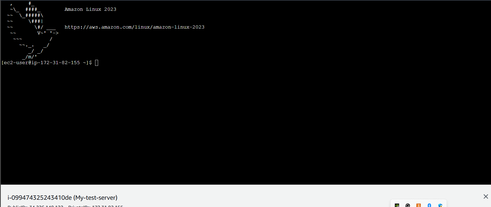

### LINUX SECURITY HARDENING 
First step was to provision my test server on the aws console manually or through my terraform script. Decided to go the manual route 


I connected to the machine using the amazon instance connect 



I then created a bash script on the machine which would:

    - Update the system
    - Install necessary packages (e.g., web server, fail2ban)
    - Configure SSH (disable root login, use key-based auth)

## Bash script creation steps
 - touch hardenscript.sh
 - nano hardenScript.sh
 ```
 #!/bin/bash

# Update the system
sudo apt update
sudo apt upgrade -y

# Install necessary packages
sudo apt install -y nginx fail2ban aide

# Configure SSH
sudo sed -i 's/#PermitRootLogin prohibit-password/PermitRootLogin no/' /etc/ssh/sshd_config
sudo sed -i 's/PasswordAuthentication yes/PasswordAuthentication no/' /etc/ssh/sshd_config
sudo systemctl restart sshd

# Configure Fail2Ban 
sudo systemctl enable fail2ban
sudo systemctl start fail2ban

echo "Initial hardening completed."

 ```

 - Make the script executable
 ```
    chmod +x hardenScript.sh
 ```

N:B this script works on most linux systems but due to the fact that I am using an amazon linux machine, the commands are slightly different as the **apt** is changed to **yum**

UPDATED SCRIPT
```
#!/bin/bash

# Update the system
sudo yum update -y

# Install necessary packages
sudo yum install -y nginx fail2ban aide

# Configure SSH
sudo sed -i 's/#PermitRootLogin yes/PermitRootLogin no/' /etc/ssh/sshd_config
sudo sed -i 's/PasswordAuthentication yes/PasswordAuthentication no/' /etc/ssh/sshd_config
sudo systemctl restart sshd

# Configure Fail2Ban (basic configuration)
sudo systemctl enable fail2ban
sudo systemctl start fail2ban

echo "Initial hardening completed."

```

- Check if the packages were installed 
```
rpm -q nginx fail2ban aide
```

I noticed there were more chnages in regards to the amazon linux machine in regards to installing fail2ban and was able to move through it using this technique
    [Fail2Ban installation](https://gist.github.com/johnstanfield/213ab7d58d585f3adce25cd16d053676)
     [More steps](https://repost.aws/questions/QU_Mw5I44TQ_ucMNb73Lakbw/fail2ban-mia-for-amazon-linux-2023)


I switched to an Ubuntu test server - 
To see if they ere installed 
```
dpkg -l | grep -E "nginx|fail2ban|aide"
```


 - Check ssh config
 ```
 sudo grep -E "PermitRootLogin|PasswordAuthentication" /etc/ssh/sshd_config

 ```
 
 


 #### SETTING UP AIDE
 On installiing aide, we review the configuration file using: 
 sudo nano /etc/aide/aide.conf
 ```
  AIDE conf
# This configuration file does not contain every possible option
# For a complete reference, see man aide.conf(5)

# set environment for executable config files included by x_include
@@x_include_setenv UPAC_settingsd /etc/aide/aide.settings.d
@@x_include_setenv PATH /bin:/usr/bin

# The daily cron job depends on these paths and settings
database_in=file:/var/lib/aide/aide.db
database_out=file:/var/lib/aide/aide.db.new
database_new=file:/var/lib/aide/aide.db.new
gzip_dbout=yes

# Set to no to disable report_summarize_changes option.
#report_summarize_changes=true

# Set to no to disable grouping of files in report.
#report_grouped=true

# have AIDE version and time of database generation in database
#database_add_metadata=true

# Set verbosity of aide run and reports
#log_level=warning
#report_level=changed_attributes
 ```

 -  Setting up the initial database
 ```
 sudo aideinit
sudo mv /var/lib/aide/aide.db.new /var/lib/aide/aide.db
 ```
 This creates a database in the /var/lib/aide folder
 

 - Set Up CRON job to do daily checks and send email
 ```
 #!/bin/bash
AIDE_OUTPUT=$(sudo /usr/bin/aide --check)
echo "$AIDE_OUTPUT" | mail -s "AIDE Integrity Check Report" your@email.com


sudo chmod +x /usr/local/bin/aide-check.sh
sudo crontab -e
0 1 * * * /usr/local/bin/aide-check.sh
 ```

 #### INSTALL LYNIS

 ```
 sudo apt install -y lynis
 sudo lynis audit system
 ```

 ***FINDINGS***
    - ! Reboot of system is most likely needed 
    - Found some information disclosure in SMTP banner 
    - iptables module(s) loaded, but no rules active 
    - Install libpam-tmpdir to Set $TMP and $TMPDIR for PAM Sessions 
    - Install apt-listbugs to Display a List of Critical Bugs Prior to Each APT 

***FIX***
```
sudo reboot

## For smtp banner
sudo nano /etc/postfix/main.cf
smtpd_banner = $myhostname ESMTP
sudo systemctl reload postfix
sudo nano /etc/exim4/exim4.conf.template
smtp_banner = "$primary_hostname ESMTP Exim"
sudo systemctl reload exim4

### Add firewalls 
sudo ufw enable
sudo ufw allow ssh
sudo ufw allow http
sudo ufw allow https
sudo ufw status

### 
sudo apt install libpam-tmpdir

###
sudo apt install apt-listbugs
```